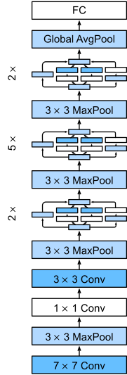

# Training on CIFAR-10
This repository is for homework of AI security.

Table of contents
=================
   * [Introduction](#introduction)
   * [Installation](#installation)
   * [Running it on CIFAR-10](#running-it-on-cifar-10)
   * [Evaluation](#evaluation)
   * [Effects of hyper-parameter on Performance](#effects-of-hyper-parameter-on-performance)

## Introduction
The model is a type of convolutional neural network based on the Inception architecture. It utilises Inception modules, which allow the network to choose between multiple convolutional filter sizes in each block. An Inception network stacks these modules on top of each other, with occasional max-pooling layers with stride 2 to halve the resolution of the grid.

### Network Architecture


The model architecture is shown in the figure above.

## Installation
### Step 1: Clone the Code from Github

```
git clone https://github.com/Resist4263/AISecurityHW.git
cd AISecurityHW
```

### Step 2: Install Requirements

```bash
bash requirements.txt
```

## Running it on CIFAR-10
While in `AISecurityHW` folder:

To train the model from scratch on CIFAR-10, do:
```bash
python train.py --is_train True
```

## Dataset
The length of training dataset is 50000, while the length of test dataset is 10000. Beacuse there is no validation dataset, I took 20% from training set as the validation set.

## Evaluation
In our experiment, batch size is 256, optimizer is Adam with learning rate of 1e-3, epoch is 50 and I choose the best model which performance best in the validation dataset during the training procedure as the final evluated model.

| Dataset | Test Accuary |
|---|-|
|CIFAR-10|86.7%|

## Effects of hyper-parameter on Performance
In this experiment, I test the impacts of different batch size, learning rate on model performance.

The results as fllows:

| batch size | Test Accuary |
| --- | --- |
| 8 | 84.7% |
| 16 | 85.9% |
| 32 | 86.6% |
| 64 | 87.4% |
| 128 | 87.2% |
| 256 | 86.7% |

| learning rate | Test Accuary |
| --- | --- |
| 1e-1 | 84.9% |
| 1e-2 | 82.7% |
| 1e-3 | 86.7% |
| 1e-4 | 78.2% |
| 1e-5 | 57.7% |

According to the experimental resutls, the model reached the highest accuary when batch size is 64 and learning rate is 1e-3.