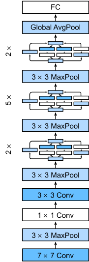

# GoogleNet on CIFAR-10
This repository is for homework of AI security.

Table of contents
=================
   * [Introduction](#introduction)
   * [Installation](#installation)
   * [Running it on CIFAR-10](#running-it-on-cifar-10)
   * [Evaluation](#evaluation)

## Introduction
GoogLeNet is a type of convolutional neural network based on the Inception architecture. It utilises Inception modules, which allow the network to choose between multiple convolutional filter sizes in each block. An Inception network stacks these modules on top of each other, with occasional max-pooling layers with stride 2 to halve the resolution of the grid.

### Network Architecture


The GoogleNet architecture is shown in the figure above.

## Installation
### Step 1: Clone the Code from Github

```
git clone https://github.com/Resist4263/AISecurityHW.git
cd AISecurityHW
```

### Step 2: Install Requirements

```bash
pip install -r requirement.txt 
```

## Running it on CIFAR-10
While in `AISecurityHW` folder:
#### Step 1: Train Model
To train the model from scratch on CIFAR-10, do:
```bash
python train.py --is_train True
```

## Evaluation
In our experiment, batch size is 256, optimizer is Adam with learning rate of 1e-3, epoch is 50 and I choose the best model which performance best in the validation dataset during the training procedure as the final evluated model.

| Dataset | Accuary |
|---|-|
|CIFAR-10|86.7%|

# Effects of hyper-parameter on Performance
In this experiment, I test the impacts of different batch size, learning rate on model performance.The results as fllows:

| batch size | Test Accuary |
| --- | --- |
| 8 |  |
| 16 ||
| 32 ||
| 64 ||
| 128 ||
| 256 | 86.7% |

| learning rate | Test Accuary |
| --- | --- |
| 1e-3 | 86.7% |